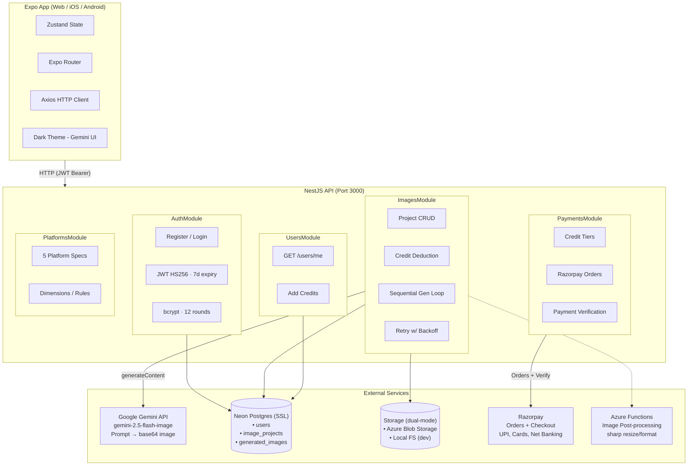
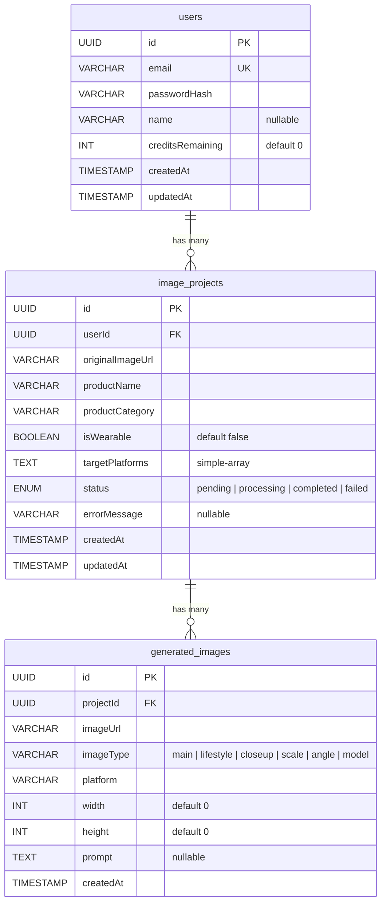
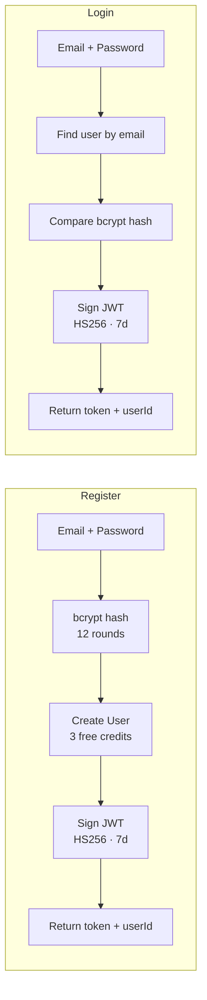

# Listic — AI-Powered E-Commerce Image Generator

Generate 6 compliance-ready product images for Amazon, Flipkart, Meesho, AJIO, and Gumroad — from a single product photo.

---

## Architecture Overview



---

## Tech Stack

| Layer            | Technology                                                     |
|------------------|----------------------------------------------------------------|
| **Frontend**     | React Native 0.76 + Expo ~52 + Expo Router ~4                 |
| **Backend**      | NestJS 10.3 (Express, CommonJS)                                |
| **AI**           | Google Gemini API (`gemini-2.5-flash-image` via `@google/generative-ai` SDK) |
| **Database**     | Neon Postgres (TypeORM, SSL, auto-sync entities)               |
| **Storage**      | Azure Blob Storage (prod) / Local filesystem (dev)             |
| **Payments**     | Razorpay (Orders + Checkout JS widget)                         |
| **Auth**         | Passport JWT (HS256, 7-day expiry) + bcrypt                    |
| **State**        | Zustand 4.4 (mobile) + expo-secure-store / localStorage       |
| **Post-process** | Azure Functions + Sharp                                        |
| **Hosting**      | Fly.io (API) / Expo (mobile/web)                               |
| **Monorepo**     | npm workspaces (`apps/*`, `packages/*`)                        |
| **Language**      | TypeScript (strict) throughout                                 |

---

## Project Structure

```
Listic/
├── package.json                         # Monorepo root — workspaces, scripts
├── README.md
├── .gitignore
│
├── apps/
│   ├── api/                             # ──── NestJS Backend ────
│   │   ├── src/
│   │   │   ├── main.ts                  # Entry: CORS, validation pipe, static uploads
│   │   │   ├── app.module.ts            # Root module: TypeORM, ConfigModule
│   │   │   │
│   │   │   ├── auth/                    # Authentication
│   │   │   │   ├── auth.module.ts       # JWT config (7d, HS256)
│   │   │   │   ├── auth.controller.ts   # POST /auth/register, /auth/login
│   │   │   │   ├── auth.service.ts      # Register (bcrypt 12), login, JWT sign
│   │   │   │   ├── auth.dto.ts          # RegisterDto, LoginDto (class-validator)
│   │   │   │   ├── jwt.strategy.ts      # Passport JWT strategy (Bearer)
│   │   │   │   └── jwt-auth.guard.ts    # @UseGuards(JwtAuthGuard)
│   │   │   │
│   │   │   ├── images/                  # Core Image Generation
│   │   │   │   ├── images.module.ts     # Wires ImagesService + ImagenService
│   │   │   │   ├── images.controller.ts # REST endpoints (file upload, generate, query)
│   │   │   │   ├── images.service.ts    # Business logic: create project, generate loop
│   │   │   │   ├── imagen.service.ts    # Gemini API client (prompt → base64 image)
│   │   │   │   ├── dto/
│   │   │   │   │   └── images.dto.ts    # CreateProjectDto, GenerateImagesDto
│   │   │   │   └── entities/
│   │   │   │       └── image-project.entity.ts  # ImageProject + GeneratedImage
│   │   │   │
│   │   │   ├── storage/                 # File Storage Abstraction
│   │   │   │   ├── storage.module.ts
│   │   │   │   └── storage.service.ts   # Azure Blob / local FS dual-mode
│   │   │   │
│   │   │   ├── users/                   # User Management
│   │   │   │   ├── users.module.ts
│   │   │   │   ├── users.controller.ts   # GET /users/me (profile + credits)
│   │   │   │   ├── users.service.ts     # CRUD, deductCredit, addCredits (atomic SQL)
│   │   │   │   └── user.entity.ts       # User entity with creditsRemaining
│   │   │   │
│   │   │   ├── payments/                # Razorpay Payments
│   │   │   │   ├── payments.module.ts
│   │   │   │   ├── payments.controller.ts  # GET /payments/tiers, POST /checkout, /webhook
│   │   │   │   ├── payments.service.ts  # Razorpay orders, signature verification, credit tiers
│   │   │   │   └── payments.dto.ts      # CreateCheckoutDto
│   │   │   │
│   │   │   └── platforms/               # Marketplace Specs
│   │   │       ├── platforms.module.ts
│   │   │       ├── platforms.controller.ts  # GET /platforms, /platforms/:slug
│   │   │       ├── platforms.service.ts
│   │   │       └── platform-specs.ts    # Amazon, Flipkart, Meesho, AJIO, Gumroad
│   │   │
│   │   ├── Dockerfile                   # Multi-stage Alpine (node:20)
│   │   ├── fly.toml                     # Fly.io deploy config (iad region)
│   │   ├── tsconfig.json                # ES2021, CommonJS, strict
│   │   ├── .env.example
│   │   └── package.json
│   │
│   ├── mobile/                          # ──── Expo App (Web + Native) ────
│   │   ├── app/                         # File-based routing (Expo Router)
│   │   │   ├── _layout.tsx              # Root Stack: auth check, dark header
│   │   │   ├── index.tsx                # Splash / landing
│   │   │   ├── upload.tsx               # Image upload + project creation form
│   │   │   ├── (auth)/                  # Auth group
│   │   │   │   ├── login.tsx
│   │   │   │   └── register.tsx
│   │   │   ├── (tabs)/                  # Dashboard tab group
│   │   │   │   ├── _layout.tsx          # Tab bar (mobile) / Sidebar (desktop ≥1024px)
│   │   │   │   ├── home.tsx             # Dashboard home
│   │   │   │   ├── projects.tsx         # Project list
│   │   │   │   └── settings.tsx         # User settings
│   │   │   ├── generate/
│   │   │   │   └── [id].tsx             # Generation progress (polls real status)
│   │   │   ├── results/
│   │   │   │   └── [id].tsx             # Generated images display
│   │   │   ├── purchase.tsx             # Purchase credits (Razorpay checkout)
│   │   │   ├── about.tsx                # About Listic page
│   │   │   └── privacy.tsx              # Privacy Policy page
│   │   │
│   │   ├── src/
│   │   │   ├── services/
│   │   │   │   └── api.ts              # Axios client + auth/images/platforms/users/payments API
│   │   │   ├── stores/
│   │   │   │   ├── auth-store.ts       # Zustand: token, userId, isAuthenticated
│   │   │   │   └── credits-store.ts   # Zustand: credits balance, fetchCredits
│   │   │   ├── hooks/
│   │   │   │   └── useResponsive.ts    # Breakpoints: sm/md/lg/xl, isDesktop
│   │   │   ├── components/
│   │   │   │   └── PageContainer.tsx   # Centered content wrapper
│   │   │   └── theme.ts               # Colors, spacing, radii, fonts, layout
│   │   │
│   │   ├── app.json                    # Expo config (dark mode, plugins)
│   │   ├── tsconfig.json               # extends expo/tsconfig.base, strict
│   │   └── package.json
│   │
│   └── functions/                       # ──── Azure Functions ────
│       ├── src/functions/
│       │   └── processImage.ts          # POST /processImage — sharp resize/bg/format
│       ├── host.json
│       └── package.json
│
└── packages/
    └── shared/                          # ──── Shared TypeScript Types ────
        ├── src/
        │   └── index.ts                 # PlatformSpec, ImageType, ProjectStatus, etc.
        └── package.json
```

---

## Database Schema



Managed by **TypeORM** with `synchronize: true` in development. Entities auto-create tables on startup.

---

## API Endpoints

### Authentication (`/api/auth`)

| Method | Endpoint           | Auth | Body                                    | Response                          |
|--------|--------------------|------|-----------------------------------------|-----------------------------------|
| POST   | `/auth/register`   | No   | `{ email, password (≥8), name }`        | `{ accessToken, userId }`         |
| POST   | `/auth/login`      | No   | `{ email, password }`                   | `{ accessToken, userId }`         |

- JWT tokens are HS256-signed, valid for 7 days
- Passwords hashed with bcrypt (12 salt rounds)
- New users receive **3 free credits**

### Images (`/api/images`) — All require JWT

| Method | Endpoint                | Body / Params                                    | Response               |
|--------|-------------------------|--------------------------------------------------|------------------------|
| POST   | `/images/projects`      | `FormData: image (≤10MB, JPEG/PNG/WebP), productName, productCategory, isWearable, targetPlatforms` | `ImageProject`         |
| POST   | `/images/generate`      | `{ projectId, additionalPrompt? }`               | `ImageProject` (status: processing — generation runs in background, poll GET for progress) |
| GET    | `/images/projects`      | —                                                | `ImageProject[]`       |
| GET    | `/images/projects/:id`  | —                                                | `ImageProject`         |

### Users (`/api/users`) — Require JWT

| Method | Endpoint       | Response                                              |
|--------|----------------|-------------------------------------------------------|
| GET    | `/users/me`    | `{ id, email, name, creditsRemaining, createdAt }`    |

### Payments (`/api/payments`)

| Method | Endpoint             | Auth | Body / Params      | Response                |
|--------|----------------------|------|--------------------|-------------------------|
| GET    | `/payments/tiers`    | No   | —                  | `CreditTier[]`          |
| POST   | `/payments/create-order` | JWT  | `{ tierSlug }`     | `{ orderId, amount, currency, keyId }`  |
| POST   | `/payments/verify` | JWT  | `{ razorpay_order_id, razorpay_payment_id, razorpay_signature }` | `{ success, credits }` |

Payment is verified server-side using HMAC-SHA256 signature validation against the Razorpay key secret.

### Platforms (`/api/platforms`) — Public

| Method | Endpoint            | Response                |
|--------|---------------------|-------------------------|
| GET    | `/platforms`        | `PlatformSpec[]`        |
| GET    | `/platforms/:slug`  | `PlatformSpec`          |

---

## Image Generation Flow

```mermaid
sequenceDiagram
    actor User
    participant App as Expo App
    participant API as NestJS API
    participant DB as Neon Postgres
    participant Store as Storage<br>(Azure / Local)
    participant AI as Gemini API<br>(gemini-2.5-flash-image)
    participant Fn as Azure Functions<br>(optional)

    Note over User, App: 1. UPLOAD
    User->>App: Select image + fill form
    App->>API: POST /images/projects (FormData)
    API->>Store: uploadFile(image)
    Store-->>API: imageUrl
    API->>DB: INSERT image_projects (status: pending)
    API-->>App: ImageProject

    Note over User, App: 2. GENERATE (non-blocking)
    User->>App: Tap "Generate"
    App->>API: POST /images/generate { projectId }
    API->>DB: UPDATE users SET credits - 1 WHERE credits > 0
    API->>DB: UPDATE project status → processing
    API-->>App: ImageProject (status: processing)
    Note over API: Fire-and-forget: background generation starts

    Note over App, API: 3. POLL FOR PROGRESS
    loop Every 4 seconds
        App->>API: GET /images/projects/:id
        API-->>App: ImageProject + generatedImages[]
        Note over App: Show count: N of 6 images done
    end

    Note over API, AI: Background: AI LOOP (×6 sequential)
    loop For each type: main, lifestyle, closeup, scale, angle, model
        API->>API: buildPrompt(type, product) + original image
        API->>AI: generateContent([prompt, imagePart])
        Note right of AI: Returns base64 image
        AI-->>API: inlineData (base64 PNG)
        Note over API: callWithRetry: 5 retries,<br>exponential backoff on 429
        API->>Store: uploadFromUrl(data:image/png;base64,...)
        Store-->>API: storedUrl
        API->>DB: INSERT generated_images
    end

    Note over API, DB: 4. COMPLETE
    API->>DB: UPDATE project status → completed
    App->>API: GET /images/projects/:id (final poll)
    API-->>App: ImageProject (status: completed) + generatedImages[6]

    Note over Store, Fn: 5. POST-PROCESS (optional)
    API->>Fn: POST /processImage { imageUrl, width, height, bg }
    Fn->>Fn: sharp resize → background → format
    Fn-->>API: Processed image buffer
```

---

## AI Prompts

The `ImagenService.buildPrompt()` method generates type-specific prompts. Each prompt is sent to Gemini **alongside the original product image** as an `inlineData` part, so the AI transforms/re-renders the actual product photo rather than generating from text alone:

| Image Type   | Prompt Template |
|-------------|-----------------|
| **main**     | Generate a professional e-commerce product shot of this item. Place it on a clean, pure white studio background with realistic drop shadows. Bright, even commercial lighting. Product fills 85% of frame. For `{platform}`. |
| **lifestyle**| Place this product in a beautiful lifestyle setting. Natural lighting, aspirational context, high quality product photography. Make it look premium and desirable for `{platform}`. |
| **closeup**  | Generate an extreme close-up detail shot of this product. Show texture, material quality, and craftsmanship. Macro photography style, studio lighting, white background. |
| **scale**    | Show this product with a size reference for scale comparison. Clean product photography on white background, professional lighting. |
| **angle**    | Photograph this product from a 45-degree angle showing depth and dimension. Professional product photography, white background, studio lighting. |
| **model**    | Render this clothing item on a professional fashion model. Show only from the neck down to the feet; do not show the face. Natural lighting, high-end editorial look for `{platform}`. |

If an `additionalPrompt` is provided, it's appended after a space.

Wearable products get 5 standard types + **model**. Non-wearable products get 5 standard types + a second **angle** variant. Max 6 images per generation.

---

## Platform Compliance Specs

| Platform   | Dimensions     | Aspect   | Max Size | Background | Min Fill | Special Rules |
|------------|---------------|----------|----------|------------|----------|---------------|
| **Amazon** | 2000 × 2000   | 1:1      | 10 MB    | White      | 85%      | No watermarks, text, logos, borders, illustrations, mannequins |
| **Flipkart** | 1024 × 1024 | 1:1      | 5 MB     | White      | 75%      | No promotional text overlays |
| **Meesho** | 1024 × 1024   | 1:1      | 5 MB     | White      | 70%      | No distracting or cluttered backgrounds |
| **AJIO**   | 1080 × 1440   | 3:4      | 5 MB     | Any (grey for apparel) | 70% | Model shots preferred for apparel |
| **Gumroad**| 1280 × 720    | 4:3      | 8 MB     | Any        | 50%      | Branding/text allowed, creative flexibility |

---

## Storage System

Dual-mode storage abstraction in `StorageService`:

| Feature        | Azure Blob (prod)                       | Local Filesystem (dev)                          |
|----------------|----------------------------------------|-------------------------------------------------|
| Upload file    | Blob container → public URL            | `uploads/` dir → `http://localhost:3000/api/uploads/...` |
| Upload from URL| Fetch → blob upload                    | Fetch → write to disk                           |
| Data URI upload| Decode base64 → blob                   | Decode base64 → write to disk                   |
| External URL   | Returns blob URL as-is                 | Reads file → returns `data:image/...;base64,...` |
| Delete         | Blob deleteIfExists()                  | fs.unlinkSync()                                 |
| Static serving | Azure CDN                              | Express static middleware at `/api/uploads`      |

Triggered by the `AZURE_STORAGE_CONNECTION_STRING` env var — if empty, falls back to local.

---

## Authentication & Credits

### Auth Flow



### JWT Token
- Algorithm: HS256
- Payload: `{ sub: userId, email }`
- Expiry: 7 days
- Transport: `Authorization: Bearer {token}`

### Credit System
- New users: **3 free credits**
- Cost: **1 credit per generation** (generates 6 images)
- Deduction: Atomic SQL `UPDATE users SET creditsRemaining = creditsRemaining - 1 WHERE id = :id AND creditsRemaining > 0`
- Addition: Atomic SQL `UPDATE users SET creditsRemaining = creditsRemaining + N WHERE id = :id`
- If 0 credits → `403 Forbidden: No credits remaining`

### Credit Pricing (Razorpay)

| Tier        | Credits | Price (INR) | Per Credit | Per Image | Savings |
|-------------|---------|-------------|------------|-----------|----------|
| **Starter** | 5       | ₹99         | ₹19.80     | ₹3.30     | —        |
| **Popular** | 15      | ₹249        | ₹16.60     | ₹2.77     | 16% off  |
| **Pro**     | 50      | ₹699        | ₹13.98     | ₹2.33     | 29% off  |

**Purchase flow:**
1. User selects a tier on the Purchase Credits screen
2. Backend creates a Razorpay Order with `notes: { userId, credits }`
3. Frontend opens Razorpay Checkout JS widget (in-page modal)
4. User pays via UPI, card, net banking, or wallet
5. On success, Razorpay returns `razorpay_payment_id`, `razorpay_order_id`, `razorpay_signature`
6. Frontend sends these to `POST /payments/verify`
7. Backend verifies HMAC-SHA256 signature and atomically adds credits
8. Success banner shown, credits refresh instantly

**Credits displayed in:** Home screen (chip), Settings (prominent card), Desktop sidebar (badge) — all link to Purchase page.

---

## Frontend Architecture

### Design System (Gemini-inspired Dark Theme)

| Token              | Value                           |
|--------------------|---------------------------------|
| Background         | `#131314` (darkest)             |
| Surface            | `#1E1F20` (cards, inputs)       |
| Tertiary           | `#282A2C` (borders, dividers)   |
| Text primary       | `#E3E3E3`                       |
| Text secondary     | `#9AA0A6`                       |
| Accent             | `#8AB4F8` (Gemini blue)         |
| Gradient           | `#8AB4F8` → `#C58AF9`          |
| Success            | `#81C995`                       |
| Content max-width  | 720px (normal), 960px (wide)    |
| Sidebar width      | 260px (desktop ≥ 1024px)        |

### Platform Brand Colors
Amazon `#FF9900` · Flipkart `#2874F0` · Meesho `#E91E63` · AJIO `#D4A574` · Gumroad `#FF90E8`

### Responsive Breakpoints

| Name       | Width   | Layout                          |
|------------|---------|----------------------------------|
| `sm`       | < 480px | Mobile — bottom tab bar          |
| `md`       | < 768px | Tablet — bottom tab bar          |
| `lg`       | ≥ 1024px | Desktop — fixed sidebar nav      |
| `xl`       | ≥ 1280px | Wide desktop — wider content     |

Desktop: Fixed left sidebar (260px) with brand, "New Project" button, and nav items.
Mobile: Bottom tab bar (60px) with icons.

### State Management

**Zustand** store (`auth-store.ts`):
```
token        — JWT access token
userId       — Current user ID
isAuthenticated — Computed from token presence
isLoading    — Loading state during token restore

Actions:
  setAuth(token, userId)  — Save to storage + update state
  logout()                — Clear storage + reset state
  loadToken()             — Restore token from SecureStore/localStorage on app init
```

**Zustand** store (`credits-store.ts`):
```
credits      — Current credit balance (number | null)
loading      — Fetching state

Actions:
  fetchCredits()  — GET /users/me → update credits
```

Storage: `expo-secure-store` (native) / `localStorage` (web), with platform-aware fallback.

### API Client

Axios instance with:
- Base URL: `EXPO_PUBLIC_API_URL` (default `http://localhost:3000/api`)
- Timeout: **120 seconds** (long image generation)
- Request interceptor: auto-attaches `Authorization: Bearer` header
- Response interceptor: auto-logout on 401

Exported method groups: `authApi`, `imagesApi`, `platformsApi`, `usersApi`, `paymentsApi`.

---

## Environment Variables

### Backend (`apps/api/.env`)

| Variable                           | Required | Description                               |
|------------------------------------|----------|-------------------------------------------|
| `DATABASE_URL`                     | Yes      | Neon Postgres connection string (SSL)     |
| `JWT_SECRET`                       | Yes      | HMAC secret for signing JWT tokens        |
| `GEMINI_API_KEY`                   | Yes      | Google AI Studio API key                  |
| `AZURE_STORAGE_CONNECTION_STRING`  | No       | Azure Blob — if empty, uses local FS      |
| `AZURE_STORAGE_CONTAINER`          | No       | Blob container name (default: `listic`)   |
| `NODE_ENV`                         | No       | `development` / `production`              |
| `PORT`                             | No       | Server port (default: `3000`)             |
| `RAZORPAY_KEY_ID`                  | No       | Razorpay Key ID (rzp_test_... or rzp_live_...) |
| `RAZORPAY_KEY_SECRET`              | No       | Razorpay Key Secret                       |
| `CORS_ORIGINS`                     | No       | Comma-separated allowed origins           |

### Frontend (`apps/mobile/.env`)

| Variable                | Description                             |
|-------------------------|-----------------------------------------|
| `EXPO_PUBLIC_API_URL`   | Backend URL (default: `http://localhost:3000/api`) |

---

## Getting Started

### Prerequisites

- Node.js ≥ 18
- npm (workspaces support)
- Gemini API key (free — [aistudio.google.com](https://aistudio.google.com))
- Neon Postgres account (free tier — [neon.tech](https://neon.tech))
- Razorpay account (optional, for payments — [razorpay.com](https://razorpay.com))

### 1. Install

```bash
npm install
```

### 2. Configure

```bash
cp apps/api/.env.example apps/api/.env
```

Fill in `DATABASE_URL`, `JWT_SECRET`, and `GEMINI_API_KEY` at minimum.

### 3. Run

**Backend:**
```bash
npm run dev:api
```

**Frontend (web):**
```bash
npm run dev:web
```

**Frontend (native):**
```bash
npm run dev:mobile
```

---

## Deployment

### Backend → Fly.io

```bash
cd apps/api
fly launch       # first time
fly deploy       # updates
fly secrets set DATABASE_URL=... JWT_SECRET=... GEMINI_API_KEY=...
```

Config: `fly.toml` — region `iad`, port 3000, force HTTPS, auto-scale min 0.

Dockerfile: Multi-stage Alpine build (`node:20-alpine`), non-root user `nestjs` (uid 1001).

### Frontend → Expo

```bash
cd apps/mobile
npx expo export --platform web     # Static web build
eas build --platform android       # Android APK/AAB
eas build --platform ios           # iOS IPA
```

### Azure Functions

```bash
cd apps/functions
func azure functionapp publish listic-functions
```

---

## Monorepo Scripts

| Script           | Command                                       |
|------------------|-----------------------------------------------|
| `npm run dev:api`   | Start NestJS dev server (watch mode)       |
| `npm run dev:web`   | Start Expo web dev server                  |
| `npm run dev:mobile` | Start Expo native dev server              |
| `npm run build:api` | Build NestJS to `dist/`                    |
| `npm run build:mobile` | Build Expo web export                   |
| `npm run lint`       | Lint all workspaces                        |
| `npm run clean`      | Clean all workspaces                       |

---

## License

Private — All rights reserved.
