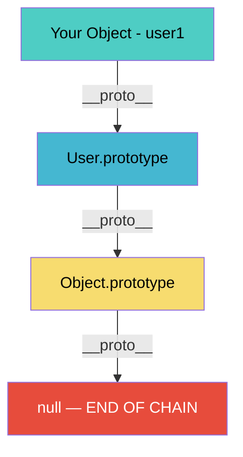
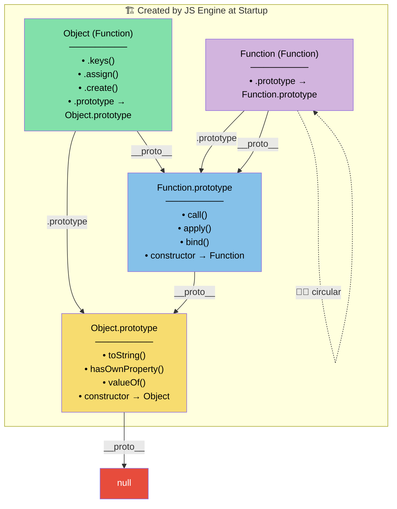
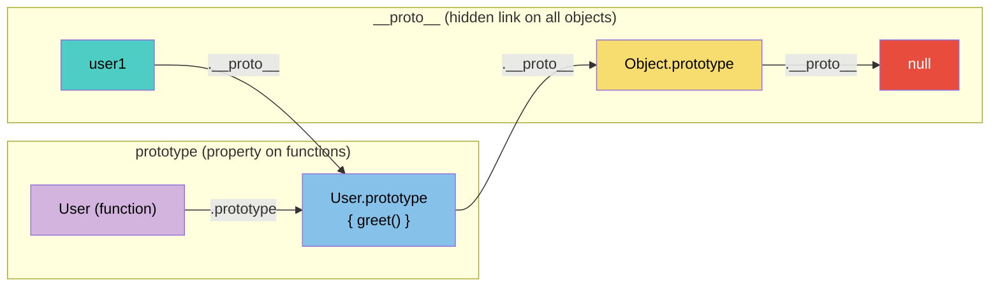
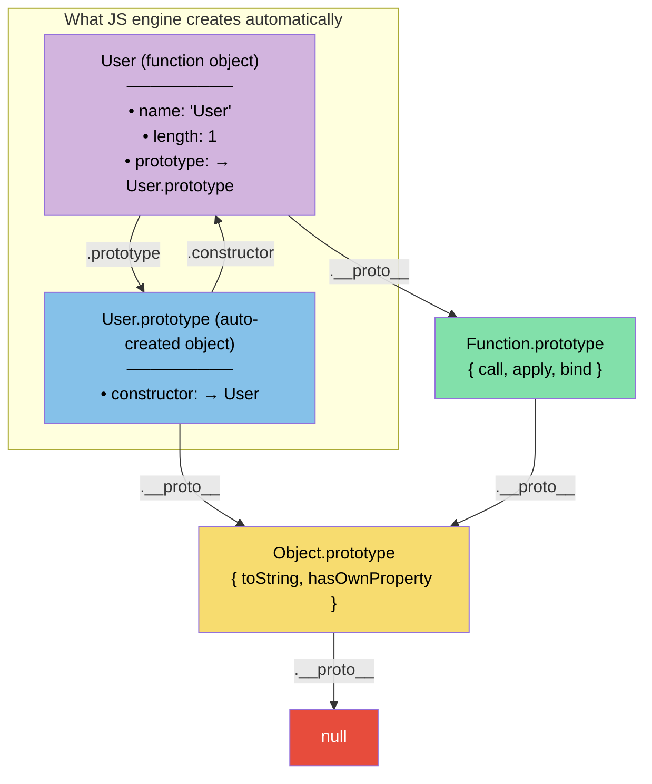
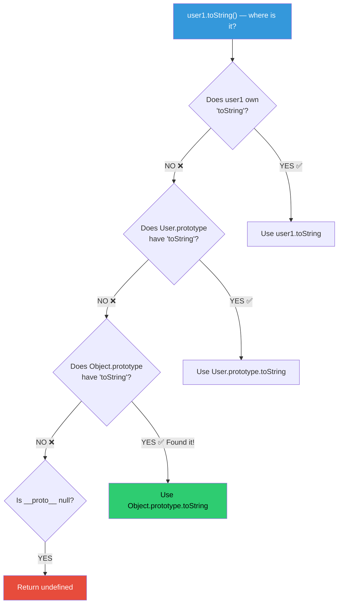
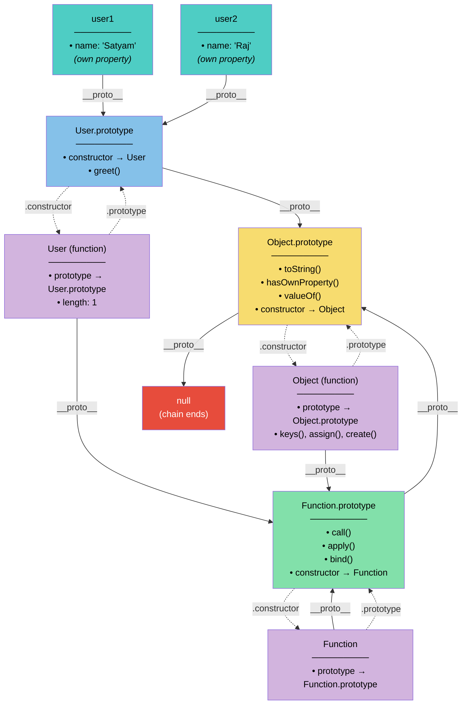
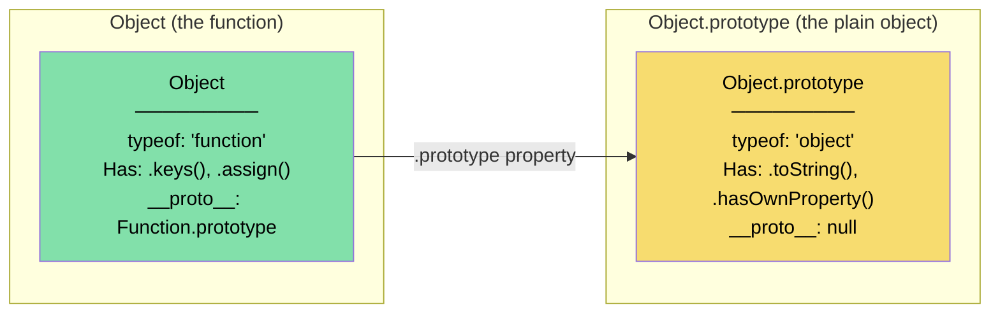
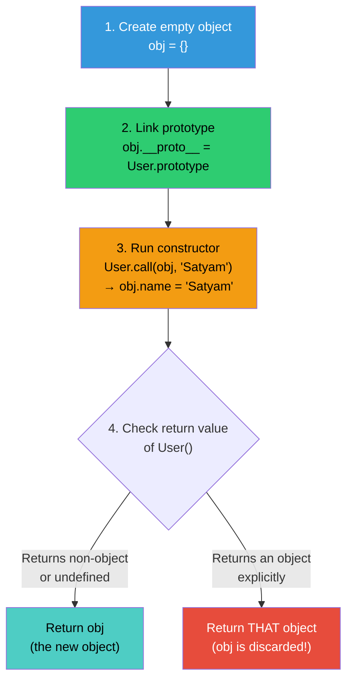
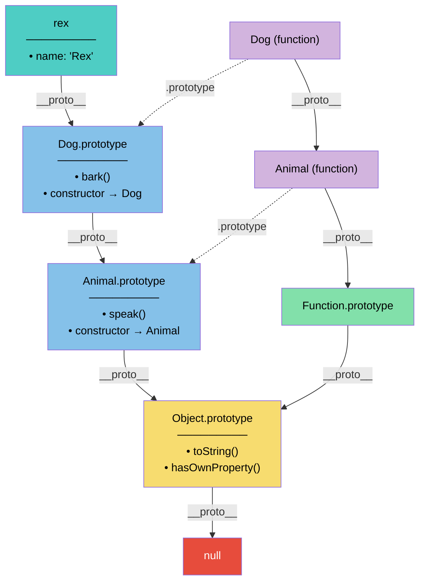

# JavaScript Prototypes & Prototypal Inheritance — The Complete Mental Model

## Table of Contents

- [The Big Picture](#the-big-picture)
- [What Exists Before Your Code Runs](#what-exists-before-your-code-runs)
- [The Core Players](#the-core-players)
- [The Two Chains: `__proto__` vs `prototype`](#the-two-chains-__proto__-vs-prototype)
- [Step-by-Step: What Happens When You Write Code](#step-by-step-what-happens-when-you-write-code)
- [Property Lookup — The Search Path](#property-lookup--the-search-path)
- [The Complete Wiring Diagram](#the-complete-wiring-diagram)
- [Common Confusions Cleared Up](#common-confusions-cleared-up)
- [The `new` Keyword — What Actually Happens](#the-new-keyword--what-actually-happens)
- [`class` Syntax — Sugar Over Prototypes](#class-syntax--sugar-over-prototypes)
- [Summary Cheat Sheet](#summary-cheat-sheet)

---

## The Big Picture

JavaScript has **no classes at its core** (even `class` is syntactic sugar). Everything is built on **objects pointing to other objects** via a hidden link called `[[Prototype]]` (exposed as `__proto__`).



> **The golden rule:** When you access a property on an object, JavaScript walks up this chain until it finds the property or hits `null`.

---

## What Exists Before Your Code Runs

Before a single line of your code executes, the JavaScript engine **pre-creates** these built-in objects:



### Engine Initialization — Behind the Scenes

Here's exactly what the engine does (conceptually) before your code runs:

```
Step 1: Create Object.prototype         → { toString, hasOwnProperty, ... }
Step 2: Set Object.prototype.__proto__  → null  (the root — chain ends here)
Step 3: Create Function.prototype       → { call, apply, bind, ... }
Step 4: Set Function.prototype.__proto__→ Object.prototype
Step 5: Create the Object function      → Object
Step 6: Set Object.__proto__            → Function.prototype (because Object IS a function)
Step 7: Set Object.prototype            → (the one from Step 1)
Step 8: Create the Function function    → Function
Step 9: Set Function.__proto__          → Function.prototype (🐔🥚 yes, it's its own instance!)
Step 10: Set Function.prototype         → (the one from Step 3)
Step 11: Create Array, String, Number, etc. — all following the same pattern
```

> **Key insight:** `Object.prototype` is the **first thing** created. Everything else is built on top of it.

---

## The Core Players

### 1. `Object.prototype` — The Grand Ancestor

This is a **plain object** that sits at the top of almost every prototype chain.

```js
// It provides these methods to ALL objects:
Object.prototype.toString()        // "[object Object]"
Object.prototype.hasOwnProperty()  // check own keys
Object.prototype.valueOf()         // primitive value
Object.prototype.constructor       // points back to Object
```

- It is **NOT** the same as `Object`
- Its `__proto__` is `null` (the chain ends here)
- Every object you create eventually inherits from this

### 2. `Object` — The Constructor Function

`Object` is a **function** whose job is to create plain objects.

```js
typeof Object;          // "function"  ← it's a function!
Object.prototype;       // { toString, hasOwnProperty, ... }
Object.__proto__;       // Function.prototype  ← because Object is a function
Object.constructor;     // Function  ← Function created Object
```

**`Object` has two kinds of methods:**

| Static Methods (on `Object` itself) | Instance Methods (on `Object.prototype`) |
|--------------------------------------|------------------------------------------|
| `Object.keys(obj)` | `obj.toString()` |
| `Object.assign(target, src)` | `obj.hasOwnProperty('x')` |
| `Object.create(proto)` | `obj.valueOf()` |
| `Object.freeze(obj)` | `obj.isPrototypeOf(other)` |

### 3. `Function.prototype` — The Function Ancestor

Every function inherits from this. It provides `call`, `apply`, `bind`.

```js
Function.prototype.__proto__ === Object.prototype;  // true — functions are objects too!
```

### 4. `Function` — The Mother of All Functions

```js
typeof Function;                    // "function"
Function.__proto__ === Function.prototype;  // true  ← 🐔🥚 it's an instance of itself!
```

### 5. Your Objects — Instances like `user1`

```js
function User(name) {
  this.name = name;
}
User.prototype.greet = function() {
  return `Hi, I'm ${this.name}`;
};

const user1 = new User("Satyam");
```

```
user1 is a PLAIN OBJECT with:
  - Own property: name = "Satyam"
  - __proto__ → User.prototype (which has greet)
  - __proto__.__proto__ → Object.prototype (which has toString, etc.)
  - __proto__.__proto__.__proto__ → null (END)
```

---

## The Two Chains: `__proto__` vs `prototype`

This is the **#1 source of confusion**. They are completely different things:

| | `__proto__` | `prototype` |
|---|---|---|
| **What is it?** | A hidden link on **every object** | A regular property on **functions only** |
| **Purpose** | Links to the object's parent for property lookup | Becomes the `__proto__` of objects created with `new` |
| **Who has it?** | Everything (objects, arrays, functions, etc.) | Only functions (and classes) |
| **Formal name** | `[[Prototype]]` internal slot | Just a normal property named "prototype" |



### The Rule

```
When you do: const user1 = new User("Satyam")

JavaScript does:  user1.__proto__  =  User.prototype
```

**`prototype` is a BLUEPRINT. `__proto__` is the LINK.**

---

## Step-by-Step: What Happens When You Write Code

### Creating a Constructor Function

```js
function User(name) {
  this.name = name;
}
```

**What the engine does behind the scenes:**



When you write `function User(name) { ... }`, the engine:

1. Creates a **function object** called `User`
2. Sets `User.__proto__ = Function.prototype` (because User is a function)
3. Auto-creates a **new plain object** called `User.prototype`
4. Sets `User.prototype.constructor = User` (circular reference)
5. Sets `User.prototype.__proto__ = Object.prototype`

### Adding Methods to the Prototype

```js
User.prototype.greet = function() {
  return `Hi, I'm ${this.name}`;
};
```

Now `User.prototype` looks like:

```
User.prototype = {
    constructor: User,       ← auto-created
    greet: function() {...}  ← you added this
}
```

### Creating an Instance

```js
const user1 = new User("Satyam");
```

> See the detailed breakdown in ["The `new` Keyword"](#the-new-keyword--what-actually-happens) section below.

---

## Property Lookup — The Search Path

When you access `user1.toString()`, JavaScript doesn't just look at `user1` — it **walks the prototype chain**.

### Search Path for an Instance (`user1.toString()`)



```js
// Let's trace each lookup:

user1.name;        // ✅ Found on user1 itself (own property)
user1.greet();     // ✅ Found on User.prototype (1 hop up)
user1.toString();  // ✅ Found on Object.prototype (2 hops up)
user1.fly();       // ❌ Not found anywhere → undefined (TypeError if called)
```

### Search Path for a Function (`User.keys` — doesn't exist)

Functions have a **different chain** than instances!

```mermaid
graph TD
    subgraph "Instance Chain (user1)"
        U1["user1"] -->|__proto__| UP2["User.prototype"]
        UP2 -->|__proto__| OP2["Object.prototype"]
        OP2 -->|__proto__| N2["null"]
    end

    subgraph "Function Chain (User)"
        UF["User (function)"] -->|__proto__| FP2["Function.prototype"]
        FP2 -->|__proto__| OP3["Object.prototype"]
        OP3 -->|__proto__| N3["null"]
    end

    style U1 fill:#4ecdc4,color:#000
    style UP2 fill:#85c1e9,color:#000
    style UF fill:#d2b4de,color:#000
    style FP2 fill:#82e0aa,color:#000
    style OP2 fill:#f7dc6f,color:#000
    style OP3 fill:#f7dc6f,color:#000
    style N2 fill:#e74c3c,color:#fff
    style N3 fill:#e74c3c,color:#fff
```



```js
// user1's chain:   user1 → User.prototype → Object.prototype → null
// User's chain:    User  → Function.prototype → Object.prototype → null

// That's why:
user1.greet();     // ✅ Works — greet is on User.prototype
User.greet();      // ❌ Fails — User walks Function.prototype chain, not User.prototype!

user1.call();      // ❌ Fails — call is on Function.prototype, not in user1's chain
User.call();       // ✅ Works — User is a function, walks through Function.prototype
```

> **Critical Insight:** `User.prototype` is NOT in `User`'s own prototype chain. It's only in the chain of objects created by `new User()`.

---

## The Complete Wiring Diagram

This is the **full picture** of how everything connects:



**Legend:**
- **Solid arrows (`__proto__`)** = prototype chain for property lookup
- **Dashed arrows (`.prototype`)** = the blueprint property on functions
- **Dashed arrows (`.constructor`)** = back-reference to the creating function

---

## Common Confusions Cleared Up

### Confusion 1: `Object` vs `Object.prototype`



```js
typeof Object;             // "function"
typeof Object.prototype;   // "object"

// Object is a FUNCTION that creates objects
// Object.prototype is a PLAIN OBJECT that all objects inherit from

// They live in DIFFERENT chains:
Object.__proto__ === Function.prototype;          // true
Object.prototype.__proto__ === null;              // true  ← dead end

// Static vs inherited:
Object.keys({a:1});           // ✅ static method on Object itself
({a:1}).keys();               // ❌ TypeError — keys is NOT on Object.prototype
({a:1}).hasOwnProperty('a');  // ✅ hasOwnProperty IS on Object.prototype
```

### Confusion 2: Why can `user1` use `toString()` but not `Object.keys()`?

```js
user1.toString();       // ✅ Works!
// Chain: user1 → User.prototype → Object.prototype.toString ✅

user1.keys();           // ❌ TypeError!
// Chain: user1 → User.prototype → Object.prototype → null
// .keys() is on Object itself, NOT on Object.prototype

Object.keys(user1);     // ✅ This is how you use it — as a static call
```

### Confusion 3: `Function` is an instance of itself

```js
Function.__proto__ === Function.prototype;  // true  🐔🥚
Function instanceof Function;              // true
Object instanceof Function;                // true  (Object is a function)
Function instanceof Object;                // true  (functions are objects)
```

This is a **bootstrap paradox** — the engine hard-wires this during setup. Don't overthink it.

### Confusion 4: `constructor` is NOT an own property

```js
user1.constructor === User;   // true — but it's NOT on user1!

user1.hasOwnProperty('constructor');              // false
User.prototype.hasOwnProperty('constructor');     // true ← it lives HERE

// user1.constructor walks the chain:
// user1 → User.prototype.constructor → User ✅
```

---

## The `new` Keyword — What Actually Happens

```js
const user1 = new User("Satyam");
```

The `new` keyword does **4 things** behind the scenes:



**Equivalent code without using `new`:**

```js
function fakeNew(Constructor, ...args) {
  // Step 1: Create empty object
  const obj = {};

  // Step 2: Link the prototype chain
  Object.setPrototypeOf(obj, Constructor.prototype);
  // same as: obj.__proto__ = Constructor.prototype

  // Step 3: Run the constructor with `this` = obj
  const result = Constructor.apply(obj, args);

  // Step 4: Return the object (unless constructor returned its own object)
  return result instanceof Object ? result : obj;
}

const user1 = fakeNew(User, "Satyam");
// Identical to: const user1 = new User("Satyam");
```

---

## `class` Syntax — Sugar Over Prototypes

`class` in JavaScript is **not a new system**. It compiles down to the exact same prototype wiring.

```js
// CLASS syntax
class Animal {
  constructor(name) {
    this.name = name;
  }
  speak() {
    return `${this.name} makes a noise`;
  }
}

class Dog extends Animal {
  bark() {
    return `${this.name} barks!`;
  }
}

const rex = new Dog("Rex");
```

**Under the hood, this creates:**



**What `extends` actually does:**

```js
// Dog.prototype.__proto__ = Animal.prototype  (instance chain)
// Dog.__proto__ = Animal                       (static method inheritance — class bonus!)
```

The `extends` keyword sets up **two chains** — one is the normal one, and the second one (function → function) is unique to `class` syntax, enabling static method inheritance.

```js
rex.bark();              // ✅ Found on Dog.prototype
rex.speak();             // ✅ Found on Animal.prototype (1 hop up)
rex.toString();          // ✅ Found on Object.prototype (2 hops up)
rex.hasOwnProperty('name'); // ✅ Found on Object.prototype
```

---

## Summary Cheat Sheet

### Identity Card for Each Player

| Entity | `typeof` | `__proto__` points to | `.prototype` points to | Role |
|--------|----------|----------------------|----------------------|------|
| `null` | "object" | — | — | End of every chain |
| `Object.prototype` | "object" | `null` | — | The grandparent of all objects |
| `Function.prototype` | "function" | `Object.prototype` | — | The parent of all functions |
| `Object` | "function" | `Function.prototype` | `Object.prototype` | Constructor for plain objects |
| `Function` | "function" | `Function.prototype` | `Function.prototype` | Constructor for functions |
| `User` (your function) | "function" | `Function.prototype` | `User.prototype` | Constructor for User instances |
| `User.prototype` | "object" | `Object.prototype` | — | Shared methods for User instances |
| `user1` (instance) | "object" | `User.prototype` | — | Your actual data object |

### Quick Verification Code

```js
// Run this in your browser console to verify EVERYTHING:

function User(name) { this.name = name; }
User.prototype.greet = function() { return `Hi, I'm ${this.name}`; };
const user1 = new User("Satyam");

// === Chain verification ===
console.log(user1.__proto__ === User.prototype);                    // true
console.log(User.prototype.__proto__ === Object.prototype);         // true
console.log(Object.prototype.__proto__ === null);                   // true

// === Function chain ===
console.log(User.__proto__ === Function.prototype);                 // true
console.log(Function.prototype.__proto__ === Object.prototype);     // true

// === Object is a function ===
console.log(Object.__proto__ === Function.prototype);               // true

// === The chicken-and-egg ===
console.log(Function.__proto__ === Function.prototype);             // true

// === constructor links ===
console.log(user1.constructor === User);                            // true
console.log(User.prototype.constructor === User);                   // true

// === instanceof walks __proto__ chain ===
console.log(user1 instanceof User);                                 // true
console.log(user1 instanceof Object);                               // true
console.log(user1 instanceof Function);                             // false
console.log(User instanceof Function);                              // true
console.log(User instanceof Object);                                // true
```

### One-Line Mental Model

> **Every object has a `__proto__` link to its parent. Functions additionally have a `.prototype` bag that becomes the `__proto__` of things they create with `new`. The chain always ends at `Object.prototype → null`.**
